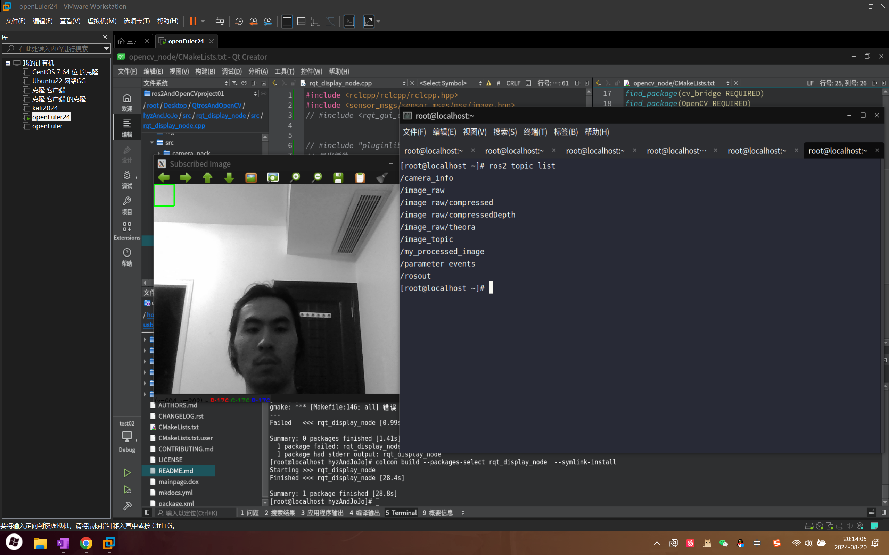

# openEuler上开发测试案例教程，ROS2+usb_cam+OpenCV+QT库实验

## 一、usb_cam源码编译，OpenCV库安装

参考 openEuler24 [编译usb_cam源码](https://openeuler-ros-docs.readthedocs.io/en/latest/other-tutorials/usb-cam-build.html)文章

## 二、需求分析，代码编写


题目如上，需求分析如下，分三个节点实现：


`ros2  run usb_cam usb_cam_node_exe `，启动usb_cam节点，


通过，opencv节点改成灰度图，继续传给三号节点显示。

```
#include <rclcpp/rclcpp.hpp>
#include <sensor_msgs/msg/image.hpp>
#include <cv_bridge/cv_bridge.h>
#include <opencv2/opencv.hpp>

class OpenCVNode : public rclcpp::Node
{
public:
    OpenCVNode() : Node("opencv_node")
    {
        // 订阅来自摄像节点的图像话题
        image_subscriber_ = this->create_subscription<sensor_msgs::msg::Image>(
            "/image_raw", 10,
            std::bind(&OpenCVNode::image_callback, this, std::placeholders::_1));

        // 创建图像发布者
        image_publisher_ = this->create_publisher<sensor_msgs::msg::Image>(
            "/my_processed_image", 10);
    }

private:
    void image_callback(const sensor_msgs::msg::Image::SharedPtr msg)
    {
        // 将ROS图像消息转换为OpenCV图像
        cv_bridge::CvImagePtr cv_ptr;
        try
        {
            RCLCPP_DEBUG(this->get_logger(), "jr1  excep");
            cv_ptr = cv_bridge::toCvCopy(msg, sensor_msgs::image_encodings::BGR8);
            RCLCPP_DEBUG(this->get_logger(), "cg2  excep");
        }
        catch (cv_bridge::Exception& e)
        {
            RCLCPP_ERROR(this->get_logger(), "cv_bridge exception: %s", e.what());
            return;  // 如果转换失败，返回
        }

        // 图像变量
        cv::Mat processed_image;

        // 通道数是 3 就是rgb 否则yuv
        if (cv_ptr->image.channels() == 3) {
            // 如果是 RGB，直接转换为 BGR
            cv::cvtColor(cv_ptr->image, processed_image, cv::COLOR_RGB2BGR);
            // 图像处理示例：将图像转换为灰度图
             cv::cvtColor(cv_ptr->image, processed_image, cv::COLOR_BGR2GRAY);

        } else {
            //  使用 YUV 转换
            cv::cvtColor(cv_ptr->image, processed_image, cv::COLOR_YUV2BGR_Y422);
            // 图像处理示例：将图像转换为灰度图
            cv::cvtColor(cv_ptr->image, processed_image, cv::COLOR_BGR2GRAY);
        }


        // 将处理后的OpenCV图像转换回ROS图像消息
        sensor_msgs::msg::Image::SharedPtr output_msg= cv_bridge::CvImage(std_msgs::msg::Header(), sensor_msgs::image_encodings::RGB8,processed_image).toImageMsg();

        RCLCPP_DEBUG(this->get_logger(), "fb3  excep");
        // 发布处理后的图像
        image_publisher_->publish(*output_msg);
        RCLCPP_DEBUG(this->get_logger(), "fbcg4  excep");
    }

    // 订阅者和发布者
    rclcpp::Subscription<sensor_msgs::msg::Image>::SharedPtr image_subscriber_;
    rclcpp::Publisher<sensor_msgs::msg::Image>::SharedPtr image_publisher_;
};

int main(int argc, char **argv)
{
    rclcpp::init(argc, argv);  // 初始化ROS 2
    rclcpp::spin(std::make_shared<OpenCVNode>());  // 运行节点
    rclcpp::shutdown();  // 关闭ROS 2
    return 0;
}

```

完整代码在我的github仓库下载，[https://github.com/jojoandgyc/PLCTandJiaChen/20240830成果02](https://)


启动，rqt图形显示节点

完成，如下



## 三、运行测试
